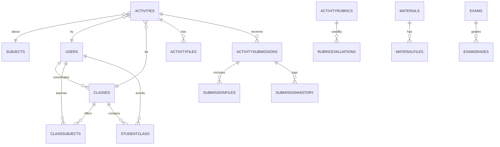
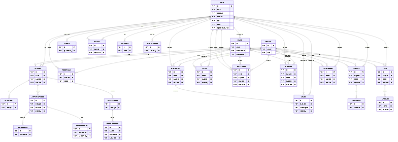

# Mapeamento OO-Relacional do SchoolManager

Este documento descreve como o modelo Orientado a Objetos (OO) do sistema se mapeia para o modelo Relacional (SQLite via Drizzle ORM). Está organizado por agregados e relações principais, seguindo o exemplo clássico de mapeamento de entidades e tabelas com chaves, associações e cardinalidades.

## Visão Geral

- Banco: `SQLite` acessado via `Drizzle ORM` (`libsql`).
- Identidade: chaves primárias do tipo `TEXT` em todas as tabelas; algumas chaves naturais com `UNIQUE` (ex.: `users.email`, `users.registrationNumber`, `subjects.code`).
- Integridade referencial: `FOREIGN KEY` via Drizzle; deleções e atualizações são tratadas pela aplicação (sem cascata automatizada).
- Polimorfismo: papéis de usuário (`role`) e estados (`status`) como enums em colunas; não há herança de tabelas.
- Agregados principais: `Class`, `Activity`, `Materials`, `Exams`. Cada agregado possui suas entidades auxiliares.

## Entidades e Tabelas

### Usuários
- Tabela: `users`
- Classe OO: `User`
- Campos: `id`, `email`, `password`, `firstName`, `lastName`, `profileImageUrl`, `role`, `status`, `lastSeen`, `phone`, `address`, `registrationNumber`, `createdAt`, `updatedAt`
- Índices: `UNIQUE(email)`, `UNIQUE(registrationNumber)`
- Cardinalidade:
  - 1:N com `classes` (como `coordinatorId`)
  - 1:N com `classSubjects` (como `teacherId`)
  - 1:N com `activities` (como `teacherId`)
  - 1:N com `studentClass` (como `studentId`)
  - 1:N com `grades` e `attendance` (como autor e como alvo `studentId`)
  - 1:N com `messages` e `notifications` (sender/recipient)

### Turmas
- Tabela: `classes`
- Classe OO: `Class`
- Campos: `id`, `name`, `grade`, `section`, `academicYear`, `capacity`, `coordinatorId`, `status`, `createdAt`, `updatedAt`
- Relações:
  - 1:N com `classSubjects`
  - N:M com `users` via `studentClass` (alunos matriculados)
  - 1:N com `events`, `notifications`, `activities`

### Disciplinas
- Tabela: `subjects`
- Classe OO: `Subject`
- Campos: `id`, `name`, `code`, `description`, `status`, `createdAt`, `updatedAt`
- Relações: 1:N com `classSubjects`, `events`, `notifications`, `activities`

### Alocação Turma–Disciplina–Professor
- Tabela: `classSubjects`
- Classe OO: `ClassSubject`
- Campos: `id`, `classId`, `subjectId`, `teacherId`, `schedule`, `room`, `semester`, `academicYear`, `status`, `createdAt`, `updatedAt`
- Cardinalidade: cada `ClassSubject` liga 1 turma a 1 disciplina e 1 professor; coleção em `Class` e `Subject`.

### Matrícula de Alunos
- Tabela: `studentClass`
- Classe OO: `StudentEnrollment`
- Campos: `id`, `studentId`, `classId`, `enrollmentDate`, `status`, `createdAt`, `updatedAt`
- Cardinalidade: N:M entre `users` (alunos) e `classes`; tabela associativa.

### Períodos Acadêmicos
- Tabela: `academicPeriods`
- Classe OO: `AcademicPeriod`
- Campos: `id`, `name`, `description`, `period`, `academicYear`, `startDate`, `endDate`, `status`, `isCurrent`, `totalDays`, `remainingDays`, `createdBy`, `createdAt`, `updatedAt`

### Sistema de Notas
- Tabela: `grades`
- Classe OO: `Grade`
- Campos: `id`, `studentId`, `classSubjectId`, `type`, `title`, `grade`, `maxGrade`, `weight`, `date`, `comments`, `createdBy`, `createdAt`, `updatedAt`
- Relações: 1:N de `ClassSubject` para `Grade`; 1:N de `User(student)` para `Grade`.

### Presenças
- Tabela: `attendance`
- Classe OO: `Attendance`
- Campos: `id`, `studentId`, `classId`, `subjectId`, `teacherId`, `date`, `status`, `notes`, `createdAt`, `updatedAt`

### Eventos e Calendário
- Tabela: `events`
- Classe OO: `Event`
- Campos: `id`, `title`, `description`, `type`, `startDate`, `endDate`, `startTime`, `endTime`, `location`, `color`, `classId`, `subjectId`, `createdBy`, `isGlobal`, `status`, `createdAt`, `updatedAt`

### Notificações
- Tabela: `notifications`
- Classe OO: `Notification`
- Campos: `id`, `title`, `message`, `type`, `priority`, `senderId`, `recipientId`, `classId`, `subjectId`, `read`, `createdAt`, `updatedAt`

### Configurações
- Tabela: `settings`
- Classe OO: `Setting`
- Campos: `id`, `key`, `value`, `description`, `category`, `updatedBy`, `createdAt`, `updatedAt`

## Agregado de Atividades

### Atividades
- Tabela: `activities`
- Classe OO: `Activity`
- Campos: `id`, `title`, `description`, `subjectId`, `teacherId`, `classId`, `dueDate`, `maxGrade`, `instructions`, `requirements`, `status`, `allowLateSubmission`, `latePenalty`, `maxFileSize`, `allowedFileTypes`, `approvedByCoordinator`, `coordinatorApprovalDate`, `coordinatorId`, `createdAt`, `updatedAt`
- Cardinalidade:
  - 1:N com `activityFiles`, `activityRubrics`, `activitySubmissions`

### Arquivos de atividade
- Tabela: `activityFiles`
- Classe OO: `ActivityFile`
- Campos: `id`, `activityId`, `fileName`, `originalFileName`, `filePath`, `fileSize`, `fileType`, `fileCategory`, `uploadedBy`, `createdAt`

### Entregas
- Tabela: `activitySubmissions`
- Classe OO: `ActivitySubmission`
- Campos: `id`, `activityId`, `studentId`, `submittedAt`, `comment`, `status`, `grade`, `maxGrade`, `feedback`, `gradedBy`, `gradedAt`, `isLate`, `latePenaltyApplied`, `finalGrade`, `createdAt`, `updatedAt`
- Cardinalidade: 1:N com `submissionFiles` e `submissionHistory`; 1:N com `rubricEvaluations`.

### Arquivos da entrega
- Tabela: `submissionFiles`
- Classe OO: `SubmissionFile`
- Campos: `id`, `submissionId`, `fileName`, `originalFileName`, `filePath`, `fileSize`, `fileType`, `uploadedAt`

### Histórico da entrega
- Tabela: `submissionHistory`
- Classe OO: `SubmissionHistory`
- Campos: `id`, `submissionId`, `action`, `performedBy`, `performedAt`, `details`, `previousStatus`, `newStatus`, `gradeChange`

### Rubricas e avaliações
- Tabelas: `activityRubrics`, `rubricEvaluations`
- Classes OO: `ActivityRubric`, `RubricEvaluation`
- Campos Rubrica: `id`, `activityId`, `name`, `description`, `criteria`, `totalPoints`, `createdAt`, `updatedAt`
- Campos Avaliação: `id`, `rubricId`, `submissionId`, `evaluatorId`, `criteriaScores`, `totalScore`, `comments`, `evaluatedAt`

## Comunicação e Relatórios

### Mensagens
- Tabela: `messages`
- Classe OO: `Message`
- Campos: `id`, `senderId`, `recipientId`, `subject`, `content`, `type`, `read`, `priority`, `parentMessageId`, `createdAt`, `updatedAt`

### Relatórios
- Tabela: `reports`
- Classe OO: `Report`
- Campos: `id`, `title`, `type`, `description`, `parameters`, `generatedBy`, `filePath`, `status`, `createdAt`, `updatedAt`

### Logs de Sistema
- Tabela: `systemLogs`
- Classe OO: `SystemLog`
- Campos: `id`, `timestamp`, `level`, `action`, `description`, `userId`, `userName`, `userRole`, `ipAddress`, `userAgent`, `locationCity`, `locationRegion`, `locationCountry`, `latitude`, `longitude`, `timezone`, `deviceType`, `os`, `osVersion`, `browser`, `browserVersion`, `metadata`, `code`

## Materiais Didáticos e Provas

### Materiais
- Tabela: `materials`
- Classe OO: `Material`
- Campos: `id`, `title`, `description`, `subjectId`, `classId`, `teacherId`, `materialType`, `content`, `folder`, `isPublic`, `status`, `createdAt`, `updatedAt`

### Arquivos de Materiais
- Tabela: `materialFiles`
- Classe OO: `MaterialFile`
- Campos: `id`, `materialId`, `fileName`, `originalFileName`, `filePath`, `fileSize`, `fileType`, `fileCategory`, `uploadedBy`, `createdAt`

### Provas
- Tabela: `exams`
- Classe OO: `Exam`
- Campos: `id`, `title`, `description`, `subjectId`, `classId`, `teacherId`, `examDate`, `duration`, `totalPoints`, `semester`, `bimonthly`, `status`, `createdAt`, `updatedAt`

### Notas de Provas
- Tabela: `examGrades`
- Classe OO: `ExamGrade`
- Campos: `id`, `examId`, `studentId`, `grade`, `isPresent`, `observations`, `gradedBy`, `gradedAt`, `createdAt`, `updatedAt`

### Horário da Turma
- Tabela: `classSchedule`
- Classe OO: `ClassSchedule`
- Campos: `id`, `classId`, `day`, `startTime`, `endTime`, `subjectId`, `teacherId`, `createdAt`, `updatedAt`

## Cardinalidades Resumidas

- `User` 1:N `Class` (coordenação) e 1:N `ClassSubject` (docência)
- `Class` 1:N `ClassSubject`; `User` N:M `Class` via `StudentEnrollment`
- `Activity` 1:N `ActivityFile` | `ActivitySubmission` | `ActivityRubric`
- `ActivitySubmission` 1:N `SubmissionFile` | `SubmissionHistory` | `RubricEvaluation`
- `Material` 1:N `MaterialFile`
- `Exam` 1:N `ExamGrade`

## Regras e Boas Práticas (Recomendadas)

- Deleção lógica para entidades sensíveis (`status`), evitando cascatas que apaguem histórico.
- Índices adicionais: `messages(recipientId, read)`, `notifications(recipientId, read)`, `attendance(studentId, date)`, `grades(studentId, date)`.
- Transações para operações em agregados (ex.: criar `Activity` + anexos/entregas).
- Versionamento de `ActivityRubric` via histórico se precisar preservar versões.

## Diagrama ER (Mermaid – exemplo parcial)

### Visualização pronta
- Imagem gerada: `SchoolManager/docs/er.png`
- Fonte Mermaid: `SchoolManager/docs/er.mmd`
- Para renderizar novamente: `npx @mermaid-js/mermaid-cli -i docs/er.mmd -o docs/er.png`

## Mapeamento OO-Relacional (Exemplos)

- `User` → `users`
  - `id: string` ↔ `id TEXT PRIMARY KEY`
  - `role: 'admin' | 'teacher' | 'student' | 'coordinator'` ↔ `role TEXT`
  - Navegações: `classesCoordenadas`, `disciplinasMinistradas`, `mensagensEnviadas/Recebidas`, `notificacoes`

- `Class` → `classes`
  - `coordinatorId: string` ↔ `FOREIGN KEY(coordinatorId) REFERENCES users(id)`
  - Navegações: `subjects`, `students`, `events`, `notifications`, `activities`

- `Activity` → `activities`
  - Navegações: `files: ActivityFile[]`, `submissions: ActivitySubmission[]`, `rubrics: ActivityRubric[]`

- `ActivitySubmission` → `activitySubmissions`
  - Navegações: `files: SubmissionFile[]`, `history: SubmissionHistory[]`, `evaluations: RubricEvaluation[]`

---

Para qualquer dúvida ou para gerar diagramas completos do banco em imagem, podemos exportar via `drizzle-kit` ou ferramentas como `DB Browser for SQLite` e complementar com diagramas UML.